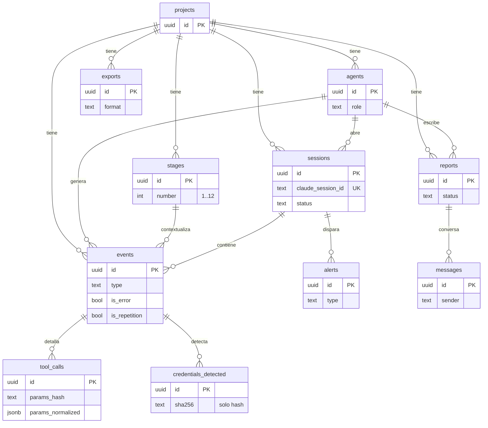

# onix-db

Esquema y **migraciones** de PostgreSQL de OnixGuard. PostgreSQL **no** va en Docker: corre directo en el VPS (lo montó el jefe). Este repo solo define **cómo luce la base** y **cómo evoluciona**.

> Postgres es externo al `docker-compose`. Los servicios se conectan por `DATABASE_URL`. Las migraciones se aplican desde `onix-deploy` (`make dev` en local; el pipeline de CD en el VPS).

---

## Qué contiene

```text
migrations/
  0001_init.up.sql     # crea todo el esquema base (§3 del plan)
  0001_init.down.sql   # lo revierte
schema.sql             # referencia consolidada (no se aplica; se regenera con pg_dump)
```

Formato **golang-migrate** (`NNNN_nombre.up.sql` / `.down.sql`). Se aplica con la imagen oficial `migrate/migrate`, sin instalar nada en el host.

## Modelo de datos (ERD)



### Decisiones de diseño
- **`events` denormaliza `project_id`, `agent_id`, `stage_id`** → los filtros de la pantalla Logs y el empuje en vivo no necesitan joins. Los índices `(campo, ts DESC)` cubren esos filtros.
- **`credentials_detected` guarda SOLO `sha256`** (+ `kind`/`label`). El valor real jamás entra a la base (lo garantiza `onix-guard`). Ver §9 del plan.
- **Enums como TEXT + CHECK** en vez de tipos ENUM nativos: más fáciles de migrar, y los valores están alineados con `onix-contracts`.
- **`uuid` con `gen_random_uuid()`** (extensión `pgcrypto`) y **`timestamptz`** en todo.
- **`ON DELETE CASCADE`** hacia `projects`/`sessions`: borrar un proyecto limpia toda su telemetría.

## Cómo aplicar las migraciones

Las dos bases del VPS (`onixguard` prod y `onixguard_test`) empiezan vacías. Para cada una:

```bash
# Con Docker (sin instalar nada):
docker run --rm -v "$PWD/migrations:/migrations" migrate/migrate \
  -path=/migrations -database "$DATABASE_URL" up

# Revertir el último paso:
docker run --rm -v "$PWD/migrations:/migrations" migrate/migrate \
  -path=/migrations -database "$DATABASE_URL" down 1
```

En desarrollo esto lo automatiza `make dev` en **onix-deploy** (aplica a la base apuntada por `DATABASE_URL`).

> ⚠️ Recordatorio del jefe: la contraseña actual de la DB es de desarrollo (débil). Cambiarla por una fuerte y guardarla en los secretos del VPS/CI antes de producción.

## Añadir una migración nueva

1. Crea `migrations/0002_<nombre>.up.sql` y `.down.sql`.
2. Corre `make test-db` (aplica up+down contra `onixguard_test`).
3. Actualiza `schema.sql` con `pg_dump --schema-only`.

---

*Parte de OnixGuard · Fase 0 (Cimientos). Ver el plan en `OnixGuard/docs/PLAN.md` §3.*
